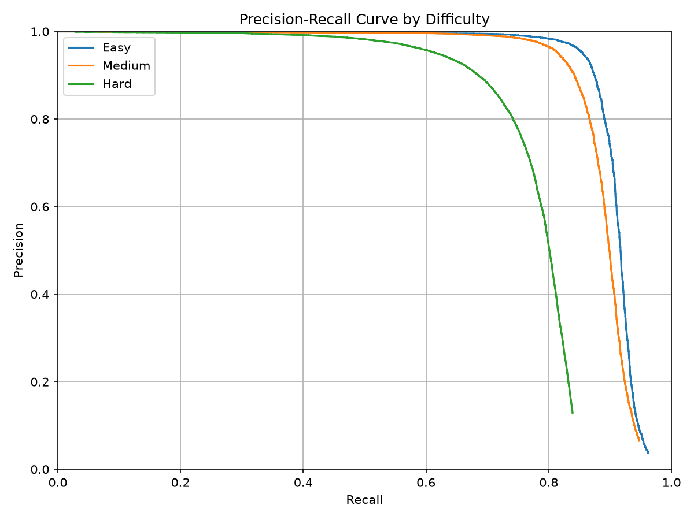

# 物体検出の評価指標

物体検出では、PredictionとGround TruthをIoUで対応させ、TP・FP・FNを決めます。

## TP・FP・FN

### TP（True Positive）

顔を正しい位置で検出できた数です。

```text
PredictionとGTのIoUが閾値以上 → TP
```

### FP（False Positive）

顔でない場所を検出した数です。位置ずれや同じ顔への重複検出もFPになります。

```text
対応するGTがないPrediction → FP
```

### FN（False Negative）

存在する顔を検出できなかった数です。

```text
対応するPredictionがないGT → FN
```

## Precision

```text
Precision = TP / (TP + FP)
```

検出結果のうち、正しかった割合です。

```text
Precisionが高い → 誤検出が少ない
```

## Recall

```text
Recall = TP / (TP + FN)
       = TP / GT総数
```

存在する顔のうち、検出できた割合です。

```text
Recallが高い → 見逃しが少ない
```

Recallの分母は、採用したPrediction数ではなく評価対象GTの総数です。

例えばGTが1,000件あり、最初のPredictionがTPなら次の値になります。

```text
TP = 1
FN = 999

Precision = 1 / 1,000ではなく、1 / (1 + 0) = 1.000
Recall    = 1 / (1 + 999)             = 0.001
```

そのため、PR曲線は一般的にPrecisionが高く、Recallが0に近い左上付近から始まります。

## Precision-Recall曲線

<p align="center">
    
<p align="center">
    <em>難易度別Precision-Recall曲線</em>
</p>

PredictionをConfidenceが高い順に1件ずつ追加し、その時点の累積TP・FP・FNからPrecisionとRecallを計算します。

```text
高いConfidenceだけを採用
→ Predictionが少ない
→ Recallは低い
→ Precisionは高くなりやすい

Confidence閾値を下げる
→ Predictionが増える
→ TPが増えてRecallが上がる
→ FPも増えるとPrecisionが下がる
```

曲線が右上に広がるほど、誤検出を抑えながら多くの顔を検出できています。

## AP

```text
AP = Precision-Recall曲線の面積
```

APは、1つのConfidence閾値だけでなく、Confidence順位全体を使ってモデルを評価します。

```text
APが高い
→ PrecisionとRecallを広い範囲で両立できている
```

本評価の`AP@0.5`は、PredictionとGTのIoUが0.5以上の場合をTPとして計算したAPです。

## まとめ

```text
TP        正しく検出できた数
FP        誤検出した数
FN        見逃した数
Precision 誤検出の少なさ
Recall    見逃しの少なさ
PR曲線    Confidence閾値を変えたときのPrecisionとRecallの関係
AP        PR曲線全体を1つの数値にまとめた評価
```
